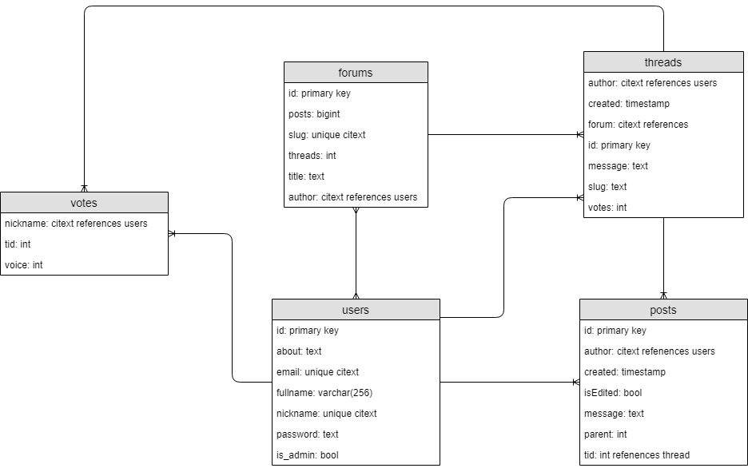
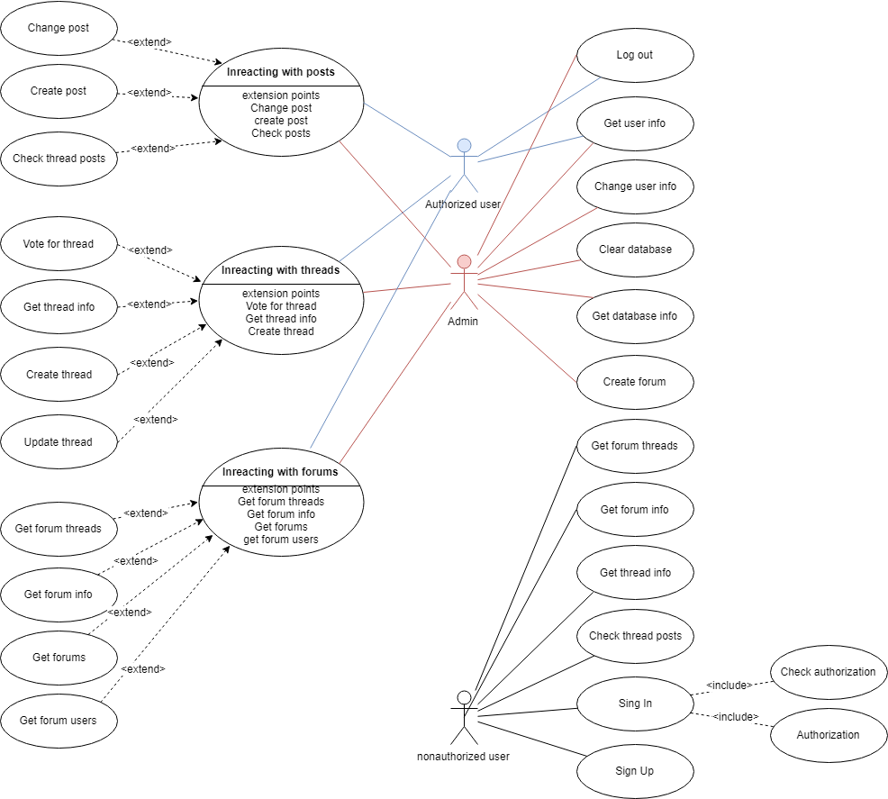

# BMSTU Web Course Project (2020)

Форум. Предполагается возможность создания форумов админами, тредов и постов всеми пользователями. Просмотр чужих профилей, изменение своего. JWT авторизация.

### ab тестирование
```
ab -n 100000 -c 100 http://127.0.0.1:8080/api/v1/forums 
This is ApacheBench, Version 2.3 <$Revision: 1807734 $>
Copyright 1996 Adam Twiss, Zeus Technology Ltd, http://www.zeustech.net/
Licensed to The Apache Software Foundation, http://www.apache.org/

Benchmarking 127.0.0.1 (be patient)
Completed 10000 requests
Completed 20000 requests
Completed 30000 requests
Completed 40000 requests
Completed 50000 requests
Completed 60000 requests
Completed 70000 requests
Completed 80000 requests
Completed 90000 requests
Completed 100000 requests
Finished 100000 requests


Server Software:        nginx/1.14.0
Server Hostname:        127.0.0.1
Server Port:            8080

Document Path:          /api/v1/forums
Document Length:        1315 bytes

Concurrency Level:      100
Time taken for tests:   24.252 seconds
Complete requests:      100000
Failed requests:        0
Total transferred:      173000000 bytes
HTML transferred:       131500000 bytes
Requests per second:    4123.33 [#/sec] (mean)
Time per request:       24.252 [ms] (mean)
Time per request:       0.243 [ms] (mean, across all concurrent requests)
Transfer rate:          6966.17 [Kbytes/sec] received

Connection Times (ms)
              min  mean[+/-sd] median   max
Connect:        0    4   3.3      4      24
Processing:     1   20  11.3     17     227
Waiting:        0   17  11.2     14     223
Total:          1   24  11.2     23     235

Percentage of the requests served within a certain time (ms)
  50%     23
  66%     27
  75%     31
  80%     33
  90%     38
  95%     43
  98%     50
  99%     58
 100%    235 (longest request)
```

### ER диаграмма базы данных



### Use-case диаграмма проекта

